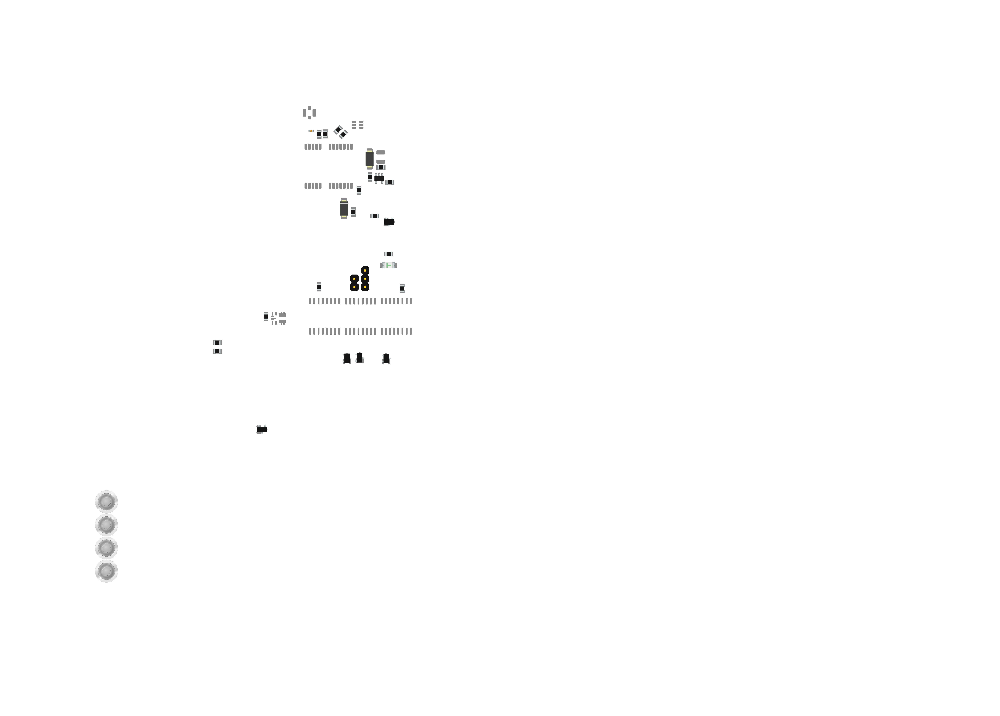
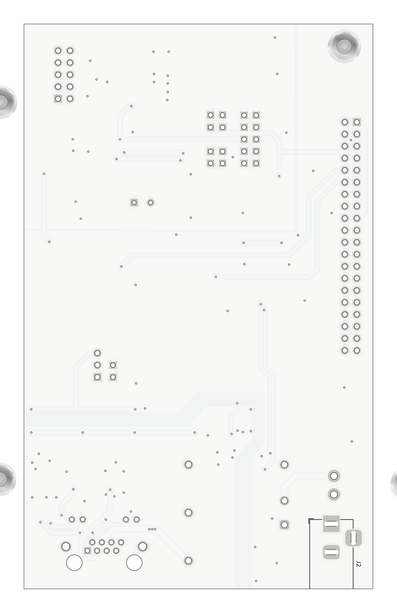

# RETERMINT01 – RETERMINAL DM Interface Board

| Top side | Bottom side |
|:---:|:---:|
|  |  |

RETERMINT01 je rozšiřující deska pro [reTerminal DM](https://wiki.seeedstudio.com/reterminal-dm/) od Seeed Studio. Deska přidává galvanicky oddělené průmyslové rozhraní — **3× RS-485** sběrnici, **izolovaný 24 V zdroj** a možnost softwarového **vypnutí napájení vzdáleného zařízení** přes GPIO. Veškerá komunikace na sběrnicové straně je plně galvanicky oddělena od logiky reTerminal DM.

Deska se připojuje přímo na 40pinový GPIO konektor reTerminal DM.

## Features

- **3× RS-485** – galvanicky oddělené half-duplex kanály (ADM2483xRW), až 500 kbps
- **Izolovaný 24 V DC/DC** – 30 W Traco Power THN 30-2423WI, softwarově spínatelný (default OFF)
- **Vzdálené vypnutí napájení** – výstup PS1 lze ovládat GPIO signálem `PWR_OFF` (active LOW)
- **5 V power module** – TI TPSM33606S5, napájí izolovanou stranu RS-485
- **u-blox NEO-M9N GPS** – s u.FL anténním konektorem, USB konfiguračním portem a zálohou 1 F superkondenzátorem
- **RJ45 se štítem a LED** – pro připojení RS-485 průmyslové sběrnice
- **ESD & přepěťová ochrana** – SM712 TVS na každém RS-485 kanálu, USBLC6-2SC6 na GPS USB
- **2× 1 A pojistka** – na 24 V vstupech

## Schematic

KiCad source files are in `hw/sch_pcb/`.

## Connectors

| Ref | Type | Description |
|-----|------|-------------|
| J2  | Barrel jack (5.5/2.1 mm) | 24 V DC power input |
| J10 | 2×20 pin, 2.54 mm | Raspberry Pi 4 / reTerminal DM GPIO header |
| J11 | RJ45 shielded + LEDs | RS-485 field bus (Amphenol RJHSE538X) |
| J8  | u.FL | GPS active antenna |
| J1  | 2×5 pin, 2.54 mm | MLAB header – GPS UART/SPI/USB signals |
| J9  | 2×1 pin, 2.54 mm | Auxiliary header |

### RS-485 channel assignment (RJ45)

Three isolated RS-485 channels (U5, U6, U7) are brought out via the RJ45 connector (J11) and controlled from the RPi UART/GPIO pins.

## Power Supply

| Rail | Source | Consumers |
|------|--------|----------|
| +24V_IN | Barrel jack J2 (18–75 V range) | PS1 input |
| +24V_OUT | THN 30-2423WI (isolated) | TPSM33606 input |
| +5V_OUT | TPSM33606S5 | ADM2483 VDD2 (isolated bus side) |
| +3V3_DIG | RPi 40-pin header pin 1/17 | ADM2483 VDD1, digital logic |
| +3V3_GPS | MIC5504-3.3YM5 LDO | NEO-M9N, USBLC6 |

> **PS1 default OFF.** The isolated DC/DC converter is disabled at power-on. Drive `PWR_OFF` GPIO **low** to enable it.

## GPIO Mapping (RPi)

| Signal | RPi GPIO | Direction | Description |
|--------|----------|-----------|-------------|
| PWR_OFF | configurable | Output | PS1 enable — active LOW |
| TIMEPULSE | configurable | Input | GPS time pulse output |
| TX/RX ch1 | GPIO14/15 (UART0) | Bidirectional | RS-485 channel 1 |
| TX/RX ch2 | configurable | Bidirectional | RS-485 channel 2 |
| TX/RX ch3 | configurable | Bidirectional | RS-485 channel 3 |

## PCB Specifications

| Parameter | Value |
|-----------|-------|
| Dimensions | 74 × 119.5 mm |
| Layers | 2 |
| Material | FR4, 1.6 mm |
| Finish | HAL |
| Min track / clearance | 0.2 / 0.2 mm |
| Min drill | 0.4 mm |
| Via | 0.6/0.3 mm |
| Eurocircuits class | 6C |

Full PCB stats: [`doc/gen/README.md`](doc/gen/README.md)

## Key Components

| Ref | Part | Description |
|-----|------|-------------|
| U4  | u-blox NEO-M9N | Multi-band GNSS module |
| U5–U7 | ADI ADM2483xRW | Isolated RS-485/RS-422 transceiver |
| U1  | TI TPSM33606S5 | 6 A, 36 V input, 5 V power module |
| U2  | Microchip MIC5504-3.3YM5 | 150 mA LDO 3.3 V |
| U3  | ST USBLC6-2SC6 | USB ESD protection |
| PS1 | Traco THN 30-2423WI | 30 W isolated DC/DC, wide input |
| C1  | 1 F supercap | GPS VBACKUP |
| D4, D5, D7 | Littelfuse SM712 | RS-485 TVS protection |
